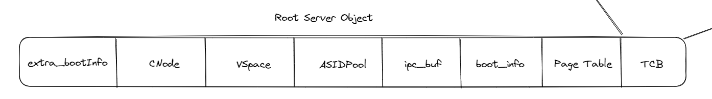
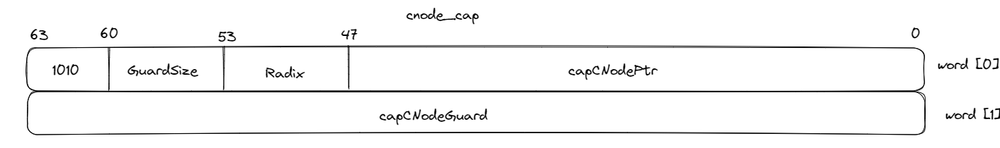

1.  第一阶段：由固化在Qemu内的一小段汇编程序负责。将必要的文件加载到物理内存后，PC（程序计数器）会被设置为**0x1000**，因此Qemu实际运行的第一条指令位于物理地址**0x1000**，接下来执行几条指令后就跳转到**0x80000000**（硬编码固化到Qemu中）并进入第二阶段。
2.  第二阶段：由bootloader负责。我们需要将bootloader（该功能由OpenSBI提供）放到以物理地址**0x80000000**开头的内存中，并跳转到该处执行。在这一阶段，bootloader负责对计算机进行一些初始化工作，并跳转到内核镜像加载的地址（该地址不固定，可能事先约定好，也可能是动态获取的）。我们选用的OpenSBI则是将下一阶段的入口地址预先约定为**0x84000000**。
3. 由内核镜像负责。为了正确与第二层对接，我们需要保证内核的第一条指令位于物理地址**0x84000000**。为此我们需要将内核镜像预先加载到Qemu物理地址的**0x84000000**开头的区域中。

然后我们看一下内核的链接脚本：
```
KERNEL_OFFSET = KERNEL_ELF_BASE_RAW - KERNEL_ELF_PADDR_BASE_RAW;

SECTIONS
{
    . = KERNEL_ELF_BASE_RAW;

    .boot.text . : AT(ADDR(.boot.text) - KERNEL_OFFSET)
    {
        *(.boot.text)
    }
    .text . : AT(ADDR(.text) - KERNEL_OFFSET)
    {
    ...
}
```

我们可以看出，内核镜像的虚拟地址编址是从 `OxFFFFFFFF84000000` 开始的，而内核镜像在运行时则是被加载到 `0x84000000` 。

在进入内核之前，`elfloader` 将a0 ~ a7 寄存器设置为 `init_kernel` 的参数，在head.S 中设置了每个核的初始栈内存后就跳转到 `init_kernel` 初始化内核了。

`seL4` 采用SMP的主从启动方式，先将0号逻辑核心启动并进行内存和系统的初始化，再初始化其他核心。

## Map Kernel Window

在初始化内核的过程中，首先需要将内核的虚拟地址进行映射，设置内核的页表，这个操作在 `map_kernel_window` 中完成。RISC-V平台下的seL4采用SV39分页机制。与SV39的相关资料在 [rCore-Tutorial-Book]([SV39 多级页表的硬件机制 - rCore-Tutorial-Book-v3 3.6.0-alpha.1 文档 (rcore-os.cn)](http://rcore-os.cn/rCore-Tutorial-Book-v3/chapter4/3sv39-implementation-1.html))中有详细描述。

```c
BOOT_CODE VISIBLE void map_kernel_window(void) {
/* kernel window starts at PPTR_BASE */
    word_t pptr = PPTR_BASE;

    /* first we map in memory from PADDR_BASE */
    word_t paddr = PADDR_BASE;
    while (pptr < PPTR_TOP) {
        assert(IS_ALIGNED(pptr, RISCV_GET_LVL_PGSIZE_BITS(0)));
        assert(IS_ALIGNED(paddr, RISCV_GET_LVL_PGSIZE_BITS(0)));

        kernel_root_pageTable[RISCV_GET_PT_INDEX(pptr, 0)] = pte_next(paddr, true);

        pptr += RISCV_GET_LVL_PGSIZE(0);
        paddr += RISCV_GET_LVL_PGSIZE(0);
    }

}
```

`map_kernel_window` 首先设置了虚拟地址从 `0xFFFF FFC0 0000 0000` 到 `0xFFFF FFFF 8000 0000` 的第一级页表项（根页表），映射到物理地址从 `0` 到 `0x3F 8000 0000` 。


```c
pptr = ROUND_DOWN(KERNEL_ELF_BASE, RISCV_GET_LVL_PGSIZE_BITS(0));
    paddr = ROUND_DOWN(KERNEL_ELF_PADDR_BASE, RISCV_GET_LVL_PGSIZE_BITS(0));

kernel_root_pageTable[RISCV_GET_PT_INDEX(KERNEL_ELF_PADDR_BASE + PPTR_BASE_OFFSET, 0)] = pte_next(kpptr_to_paddr(kernel_image_level2_pt), false);
kernel_root_pageTable[RISCV_GET_PT_INDEX(pptr, 0)] = pte_next(kpptr_to_paddr(kernel_image_level2_pt), false);

while (pptr < PPTR_TOP + RISCV_GET_LVL_PGSIZE(0)) {
	kernel_image_level2_pt[index] = pte_next(paddr, true);
	index++;
	pptr += RISCV_GET_LVL_PGSIZE(1);
	paddr += RISCV_GET_LVL_PGSIZE(1);
}


```

然后开始设置 `kernel image` 的映射。这里设置了两个虚拟地址指向同一个二级页表，一个是 `0xFFFFFFFF80000000`，另一个是 `FFFFFFC084000000` 。然后在二级页表中设置二级映射。物理地址从 `0x80000000` 到 `0xC0000000`。

完成页表的设置之后，就开始初始化CPU，写入根页表地址到 `satp` 并开启 SV39分页机制。写入 `trap entry` 地址到`stvec` 寄存器并开启外部中断和时钟中断。

## 空闲的物理地址初始化

在kernel初始化时需要将空闲的物理地址同一组织起来进行管理，等到 root server 初始化完成后再将剩余的物理地址以 `untyped` 的形式授权给 root server。

初始化空闲物理地址的入口在 `arch_init_freemem` 。在初始化阶段维护了一个`res_reg[]` 的全局变量用于存储保留的物理地址对应的虚拟地址范围，其中包括了内核镜像对应的 `0xFFFFFFC084000000` 开头的虚拟地址、`dtb` 对应的在内核地址空间`0xFFFFFFC084000000` 开头的虚拟地址。、用户镜像物理地址在内核地址空间`0xFFFFFFC084000000`开头的虚拟地址。如下所示：
```
reserved virt address space regions: 3
  [ffffffc084000000..ffffffc084020000]
  [ffffffc084020000..ffffffc0840203a1]
  [ffffffc084021000..ffffffc084407000]
```

而设备上可访问的物理地址范围由全局变量 `avail_p_regs` 设置（代码自动生成）。

`seL4` 在 bootstrapping 阶段维护了一个 `ndks_boot` 的全局变量，用于存储该阶段的一些全局信息，可用物理内存就保存在其中的 `freemem[]` 字段中。我们将 `avail_p_regs` 可访问部分去除与 `res_reg` 重合的部分，就是可用的地址。最终得到的 `freemem` 范围为：

```
ndks_boot.freemem[0]: 0xffffffc080200000 ... 0xffffffc084000000
ndks_boot.freemem[1]: 0xffffffc0840203a1 ... 0xffffffc084021000
ndks_boot.freemem[2]: 0xffffffc084407000 ... 0xffffffc17ff00000
```

## 初始化root server

在 `elfloader` 阶段就已经将 root server镜像加载到了物理内存中，将镜像的物理起始地址、物理终止地址、entry的虚拟地址、物理地址和虚拟地址的偏移量都以参数的形式传入内核入口函数。

我们需要先创建一个root server对象，他在内核中包含了如下部分：


这些部分除了PageTable所占大小，其他都是固定大小，PageTable的大小取决于 root server的镜像大小。因此我们可以计算出整个Object的大小，然后从后往前遍历 `ndks_boot.freemem` ，找到一个大小合适的内存范围并分配给 root server object。并创建和初始化 Object：

```c
BOOT_CODE static void create_rootserver_objects(pptr_t start, v_region_t it_v_reg,
                                                word_t extra_bi_size_bits)
{
    /* the largest object the PD, the root cnode, or the extra boot info */
    word_t cnode_size_bits = CONFIG_ROOT_CNODE_SIZE_BITS + seL4_SlotBits;
    word_t max = rootserver_max_size_bits(extra_bi_size_bits);

    word_t size = calculate_rootserver_size(it_v_reg, extra_bi_size_bits);
    rootserver_mem.start = start;
    rootserver_mem.end = start + size;

    maybe_alloc_extra_bi(max, extra_bi_size_bits);

    /* the root cnode is at least 4k, so it could be larger or smaller than a pd. */
#if (CONFIG_ROOT_CNODE_SIZE_BITS + seL4_SlotBits) > seL4_VSpaceBits
    rootserver.cnode = alloc_rootserver_obj(cnode_size_bits, 1);
    maybe_alloc_extra_bi(seL4_VSpaceBits, extra_bi_size_bits);
    rootserver.vspace = alloc_rootserver_obj(seL4_VSpaceBits, 1);
#else
    rootserver.vspace = alloc_rootserver_obj(seL4_VSpaceBits, 1);
    maybe_alloc_extra_bi(cnode_size_bits, extra_bi_size_bits);
    rootserver.cnode = alloc_rootserver_obj(cnode_size_bits, 1);
    ...
```

该函数主要是初始化全局变量 `rootserver` 所代表的 object 的各个组成部分的起始地址。

### 创建Root CNode

之前已经对整个 Root Server Object 进行了初始化，现在来构造Root Server的能力空间，主要是CNode。
```c
BOOT_CODE cap_t
create_root_cnode(void)
{
    cap_t cap = cap_cnode_cap_new(
                    CONFIG_ROOT_CNODE_SIZE_BITS, /* radix */
                    wordBits - CONFIG_ROOT_CNODE_SIZE_BITS, /* guard size */
                    0, /* guard */
                    rootserver.cnode); /* pptr */

    /* write the root CNode cap into the root CNode */
    write_slot(SLOT_PTR(rootserver.cnode, seL4_CapInitThreadCNode), cap);

    return cap;
}
```



其中的capCNodePtr指向 server 的cnode地址。

### 创建Root VSpace

然后按照上述方法依次创建 `domain cap` 、`IRQControl cap` 、`boot info frame cap`、`ipc buf frame cap` 等等。注意在创建 `frame cap` 时需要将对应的虚拟地址对应的物理地址映射到地址空间中，因此需要先创建 `root server` 的 `VSpace` 。

```c
BOOT_CODE cap_t create_it_address_space(cap_t root_cnode_cap, v_region_t it_v_reg)
{
    cap_t      lvl1pt_cap;
    vptr_t     pt_vptr;

    copyGlobalMappings(PTE_PTR(rootserver.vspace));

    lvl1pt_cap =
        cap_page_table_cap_new(
            IT_ASID,               /* capPTMappedASID    */
            (word_t) rootserver.vspace,  /* capPTBasePtr       */
            1,                     /* capPTIsMapped      */
            (word_t) rootserver.vspace   /* capPTMappedAddress */
        );

    seL4_SlotPos slot_pos_before = ndks_boot.slot_pos_cur;
    write_slot(SLOT_PTR(pptr_of_cap(root_cnode_cap), seL4_CapInitThreadVSpace), lvl1pt_cap);
    ...
}
```

用户任务的 `VSpace` 存放的实际上就是第一级页表项。 root server需要访问内核的所有地址，因此先将内核的第一级页表项全部复制给 root server，然后在 CNode的相应位置写入 VSpace 的 cap。

```c
BOOT_CODE cap_t create_it_address_space(cap_t root_cnode_cap, v_region_t it_v_reg)
{
	...
	/* create all n level PT caps necessary to cover userland image in 4KiB pages */
    for (int i = 0; i < CONFIG_PT_LEVELS - 1; i++) {

        for (pt_vptr = ROUND_DOWN(it_v_reg.start, RISCV_GET_LVL_PGSIZE_BITS(i));
             pt_vptr < it_v_reg.end;
             pt_vptr += RISCV_GET_LVL_PGSIZE(i)) {
            if (!provide_cap(root_cnode_cap,
                             create_it_pt_cap(lvl1pt_cap, it_alloc_paging(), pt_vptr, IT_ASID))
               ) {
                return cap_null_cap_new();
            }
        }

    }

    seL4_SlotPos slot_pos_after = ndks_boot.slot_pos_cur;
    ndks_boot.bi_frame->userImagePaging = (seL4_SlotRegion) {
        slot_pos_before, slot_pos_after
    };

    return lvl1pt_cap;
}
```

然后遍历镜像的虚拟地址，构建镜像虚拟地址到物理地址的一级页表映射和二级页表映射后返回 `VSpace cap` 。（为什么不在这里构建第三级页表映射？这里只负责构造页表结构的创建和映射，不负责叶子节点（即真正的镜像数据的地址映射））。

### 创建root server的frame cap

之前完成了二级页表的创建和映射，现在需要完善所有root server image用到的image frame。主要包括了：`boot info frame`、`extra boot info frame` 、`ipcbuf frame` 、`userland image frames` 。以 `ipcbuf frame` 为例：

```c
BOOT_CODE cap_t create_ipcbuf_frame_cap(cap_t root_cnode_cap, cap_t pd_cap, vptr_t vptr)
{
    clearMemory((void *)rootserver.ipc_buf, PAGE_BITS);

    /* create a cap of it and write it into the root CNode */
    cap_t cap = create_mapped_it_frame_cap(pd_cap, rootserver.ipc_buf, vptr, IT_ASID, false, false);
    write_slot(SLOT_PTR(pptr_of_cap(root_cnode_cap), seL4_CapInitThreadIPCBuffer), cap);

    return cap;
}

```

这里先清空了 `ipc_buf` 中的数据，然后将 ipc_buf 对应的物理地址和虚拟地址映射起来（注意比较这里与上面创建二级页表的不同），返回一个 `frame cap` ，写入 `CNode` 中。

### 创建 initial thread

将 `root server` 的各个内核对象都初始化完成之后，就开始创建第一个初始线程。

```c
BOOT_CODE tcb_t *create_initial_thread(cap_t root_cnode_cap, cap_t it_pd_cap, vptr_t ui_v_entry, vptr_t bi_frame_vptr,
                                       vptr_t ipcbuf_vptr, cap_tipcbuf_cap)
{
    tcb_t *tcb = TCB_PTR(rootserver.tcb + TCB_OFFSET);
#ifndef CONFIG_KERNEL_MCS
    tcb->tcbTimeSlice = CONFIG_TIME_SLICE;
#endif

    Arch_initContext(&tcb->tcbArch.tcbContext);

    /* derive a copy of the IPC buffer cap for inserting */
    deriveCap_ret_t dc_ret = deriveCap(SLOT_PTR(pptr_of_cap(root_cnode_cap), seL4_CapInitThreadIPCBuffer), ipcbuf_cap);
    if (dc_ret.status != EXCEPTION_NONE) {
        printf("Failed to derive copy of IPC Buffer\n");
        return NULL;
    }
	...
}
```

这里先从 `rootserver` 中获得 tcb 对应的指针，然后将 TCB 中保存的的 `sstatus` 寄存器设置为 `SPIE` （使能 supervisor interrupts）。然后将原先的 `ipcbuf cap` 进行了一个拷贝派生。

```c
BOOT_CODE tcb_t *create_initial_thread(cap_t root_cnode_cap, cap_t it_pd_cap, vptr_t ui_v_entry, vptr_t bi_frame_vptr,
                                       vptr_t ipcbuf_vptr, cap_tipcbuf_cap)
{
	...
/* initialise TCB (corresponds directly to abstract specification) */
    cteInsert(
        root_cnode_cap,
        SLOT_PTR(pptr_of_cap(root_cnode_cap), seL4_CapInitThreadCNode),
        SLOT_PTR(rootserver.tcb, tcbCTable)
    );
    cteInsert(
        it_pd_cap,
        SLOT_PTR(pptr_of_cap(root_cnode_cap), seL4_CapInitThreadVSpace),
        SLOT_PTR(rootserver.tcb, tcbVTable)
    );
    cteInsert(
        dc_ret.cap,
        SLOT_PTR(pptr_of_cap(root_cnode_cap), seL4_CapInitThreadIPCBuffer),
        SLOT_PTR(rootserver.tcb, tcbBuffer)
    );
    tcb->tcbIPCBuffer = ipcbuf_vptr;
    ...
}

```

然后往TCB中的`tcbCTable Slot`插入了 `CNode Cap` ，往 `tcbVTable Slot` 中插入 `VSpace cap` ，往 `tcbBuffer Slot` 中插入派生的 `IPCBuffer cap` 。

本质上 `TCB Object` 存放了各种各样的 `cap` 。


