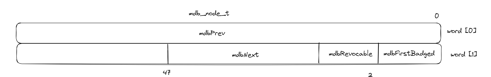

介绍了 `seL4` 提供的物理内存管理的解决方案。

## Introduction & Requirement

- 部分系统中，内核本身作为内存管理器提供内存管理服务，导致内存管理的中心化，而且导致系统不够鲁棒。
- 大部分内核中提供的服务如pages和Thread不仅需要申请直接访问的内存，还可能会造成内存的隐式分配（如TCB和page table），内核隐式持有额外的物理内存，对内存管理和统计造成了很大的复杂性。
- 物理内存作为有限资源，要防止某个任务请求内存导致另一个任务被拒绝服务的情况发生。
	- 任务配额和静态预分配的方法将导致内存浪费，且不支持内存重用。
- 部分内核中，将内核的物理内存当作缓存（如文件系统），这会导致一个任务的请求在缓存中驱逐了另一个任务的条目，从而导致后一个任务的系统调用延迟，造成任务执行时间的不可预测性；内存管理分配中的簿记结构也会影响事件延迟的可预测性，遍历列表或树会导致执行时间的长度不一致。
	- 内核的物理存储管理方案必须要为，需要提供可预测性的任务，保证可预测的访问时间。
	- 理想情况下，所有的系统调用都将在恒定的时间内完成，
- 部分内核仅支持单一的物理内存管理策略，不能支持应用的 best-effort
- 内存分配的安全性没有经过形式化验证。

因此文章提出一种内存管理策略：
- 使用微内核架构将内存管理分离出内核，去中心化。
- 消除从内核隐式分配元数据的需要并促进所有的元数据转化为fisrt-class object并且显式分配。
- 使用UM和CDT的形式实现内存的动态分配和重用。
- 内核的物理内存除了boot阶段所占用的静态物理内存，不占据其他任何物理内存。
- 基于Cap机制，使用Isabelle/HOL验证了内存分配模型的安全性。

## seL4 Memory Allocation Model

### Allocate Memory Explicitly

在模型中，每个内核对象被实现为一个特定的可执行操作的对象，这些操作和对象合起来组合成一个抽象，用户通过invoke对象对应的Cap来申请服务。这些内核对象都是由用户显式分配。

除了这些显式分配的内核对象外，内核不分配任何元数据。

显式分配为用户接口提供了灵活性（有用户显示指定内核对象的类型和分配时机），同时简化了内存分配的隔离问题：为了实现隔离，我们只需要精准的控制显式分配。

在 boot 阶段，seL4 就预分配了所有内核需要的内存，包括了 code, data, stack section（seL4 是单内核栈）等。剩余的所有内存以 untyped memory（UM）的形式交给了第一个用户态任务（root server）。一个UM可以用于生成其他更小的power-of-two sized的对齐的内核对象，这些新的对象对应的cap是 `children` ，原先的 UM 的 cap 是 `parent` 。

通过retyped 申请内核对象的任务获得了该对象的所有权限，然后可以通过grant IPC channel将该对象的部分权限传递给其他任务。

实现对象所需的所有物理内存在对象创建时就预先分配在对象中，并且不超过从中提炼出的 UM 的大小。 这消除了内核动态分配内存以满足用户级任务请求的需要。

### Re-using Memory

为了能够在动态系统中重用内存，内核需要保证这片内存实现的对象不再具有有效引用。seL4通过跟踪Cap派生来实现这一点，各个具有派生关系的Cap构成一个 `capability derivation tree` （CDT）。当在 UM 上调用 retype 生成新的内核对象时，新对象的 cap 会作为 UM 的 cap 的子节点插入 CDT 中。同样的，任何的 cap 的复制操作也将被作为原始 cap 的子节点插入 CDT 中。

为了避免CDT的动态内存分配， CDT 被实现为存储在 cap 本身中的双向链表。该链表相当于 CDT 的后序遍历的逻辑树。为了从列表中重建树，内核使用标记位和物理地址比较的组合来确定相邻的一对能力是否具有父子关系。

原始的UM拥有撤销它所派生内核对象的权限，通过查找CDT可以找到派生出的内核对象有哪些。此操作可能耗时较长，因此是可抢占的。

## Performance Evaluation

测试集是 `lmbench` 测试套，分别在 `seL4:Pistachio` 和 `L4/Iguana` 上搭建半虚拟linux系统，分别称为 `seL4::Wombat` 和 `L4::Wombat` 。

`Iguana` 是运行在用户态的一个基于capabilities 的小型操作系统，在该系统中，获取需要分配内核元数据的内核服务的权限集中在 `Iguana` 中——任何可能需要分配内核元数据的内核服务都必须通过`Iguana`，由 `Iguana` 监控，通过这种方式， `Iguana` 对 `L4::Wombat` 的内存消耗进行了严格控制。

而与之相对的， `seL4::Wombat` 通过控制 `Untyped Cap` 的传播来实现内存消耗的控制，一旦`seL4:Pistachio` 完成自我引导，他会调用一个资源管理器任务，该资源管理器随后会引导 `seL4::Wombat` 。在引导过程中，资源管理器 grant `seL4::Wombat` 一组 UM cap，从而允许它直接分配、取消和管理内核对象。

主要进行了三组实验，第一组测试需要物理内存分配的操作的时延，如（pagefault、fork、exec、shell），第二组测试了不需要分配物理内存的系统调用的时延，第三组测试了一些内存读写的吞吐量。

从实验结果看，`seL4::Wombat`在第一组测试中性能明显优于`L4::Wombat`，其他两组的性能差距很小。据作者分析，seL4 通过分散资源管理，消除了 Linux 通过 `Iguana` 代理将请求传输到微内核来实施隔离的需求。同时，Linux本身可以自由共享或隔离它提供给其他客户任务的资源，消除了微内核强制执行隔离策略的需要。

## Question

1. 内核对象是在当前任务所拥有的UM中申请的，那用户任务是否可以直接访问内核对象？这样是否会不够安全？
	1. 需要注意的时候，当前任务所拥有的是使用UM生成内核对象的权力，并不能直接访问该内存，生成的内核对象数据也不会映射到该任务的地址空间。
2. 为什么不选择引用计数的方式来判断该内存对象是否还具有有效引用呢？
	1. 简单的引用计数无法表明cap之间的派生关系，CDT的作用不只是为了统计当前对象能否销毁，还可以跟踪派生关系。
3. 这篇文章前半部分讲了一个合格的内存管理模式应该拥有怎样的特征。后半部分根据前半部分的特征，在微内核架构上，使用显式分配内核对象的方式，避免了内核对动态物理内存的持有，通过Cap传递和撤销的方式，实现了动态内存管理和隔离。想起向老师的之前提到的，将 seL4 的安全机制作为 rCore 的一个安全隔离层，我现在的理解是，seL4 的 cap 机制更像是一个逻辑上的隔离层，在具体实施上，表现为用户态程序自身对权限的良好控制。我理解的安全隔离有两个方面：1. 内核与用户态的隔离；2. 用户程序之间的隔离。我的理解是，在 seL4 中，前者通过虚拟内存和页表保证，后者通过 Cap 保证。
4. 本文中有涉及到形式化验证的部分，关于不变量的设定与检查，看不太懂，但是看起来很合理。

