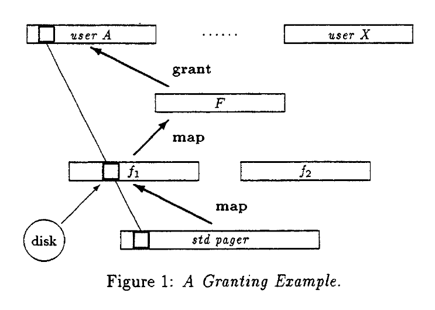

# 微内核的一些基本概念

## 地址空间
微内核是所有应用程序共有的一层，必须隐藏地址空间的硬件概念，同时允许在微内核之上实施保护和非保护的方案。

一个简单的idea是支持递归构建在内核之外的地址空间，最开始有一个地址空间 $\sigma_0$ 代表物理地址并且被子系统 $S_0$ 控制，在系统启动时，其他所有的地址空间都是空的，为了构建和维护在 $\sigma_0$ 之上的地址空间，微内核需要提供三种操作：
- grant：地址空间的所有者可以将自己的页授权给其他地址空间，授权之后从原先的地址空间删除，转移到新的地址空间。需要注意的是，授权者授权的是自己可以访问的页面的权力，而不是物理页框本身。
- map：地址空间所有者可以映射自己拥有的任何页到其他地址空间，类似于共享内存。
- Flush：删除从flusher中直接或间接得到页访问权的地址空间中的相应页。

内核只提供这地址空间的三种操作，地址空间的管理全部在内核之外。

通常情况下，系统使用grant来实现页面映射的传递，这样可以防止多次map导致的bookkeeping和内存过多占用。

在该模型的基础上，可以很容易的附加访问权限控制，如在map和grant时同时复制访问权限或其子集，flush操作仅仅移除某些权限等等。

## Thread and IPC
线程的抽象基本和宏内核类似，是运行CPU的抽象，但有以下区别：
- 为了防止地址空间污染，所有的对线程的地址空间的修改必须通过内核控制。（why？）
IPC作为构建系统的基础功能需要内核参与。
内核不保留中断的语义信息，将中断原封不动交由用户态进行处理（类似于用户态中断？）

## 唯一标识符
由于IPC需要标识符来指明发送端和接收端，因此内核还需要维护各个对象的全局唯一的标识符。

## 总结
微内核仅仅为上层应用提供少数的几种服务：
- 线程管理。
- 低级的存储管理。
- IPC
- 中断的简单处理

# 几个子系统的基本实现

## 内存管理

一个初始服务器子系统$M_0$构造了初始的地址空间$\sigma_0$ 这个子系统是一个传统的主存储管理系统，但是在内核之外。$M_0$ 通过map或grant将部分物理地址从 $\sigma_0$转移到子系统$M_1$ 下的地址空间 $\sigma_1$ 和子系统 $M_2$ 下的地址空间 $\sigma_2$ ，现在就有两个共存的内存管理器了。

## 分页管理（Pager）

Pager实现用户程序的虚拟地址和物理地址的映射系统，它起到一个媒介的作用，主要是涉及到以下几个系统的通信：
- pager <-->client
- pager <--> memory server
- pager <--> device driver
它们都使用IPC进行通信。

Pager可以使用传统的虚拟内存和文件映射来实现。此外，可以使用多层Pager来将不同的Pager组合统一起来。

## 多媒体资源分配

多媒体和其他实时应用需要以一种可预测运行时的方式来分配内存资源，上诉提到的内存和分页管理可以提供为特定数据固定分配物理内存或在给定时间内锁定内存中的数据（？）。

## 设备驱动

是运行在用户态的进程，可以直接访问映射在地址空间中的硬件IO port，通过IPC从硬件中断中接收消息，事实上，所有的设备驱动都运行在用户态，并不比其他用户态程序特别。

# 个人思考
1. 微内核结构中，内核只提供少量基本的服务，非必要的模块如分页管理和文件系统都以用户态程序运行，宏内核中通过系统调用实现的功能现在就要通过IPC实现，IPC和系统调用谁的耗费更大？
	1. 一般而言，系统调用中内核可以直接访问用户程序的数据，而IPC中需要进行更多的拷贝，因此IPC会慢。
	2. 事实上，这也是微内核在此前一直比宏内核更慢的主要原因之一，IPC的实现也是影响性能的重要因素，三代微内核都有在IPC上进行改进。

# seL4的内核服务
## 内核对象
- CNodes：存储多个能力（不可伪造的令牌，存储对象访问方法需要的权限）。每个CNode有固定数量的slot，Slots可以是空的，也可以包含能力。
- 线程控制块（TCB）：表示一个线程，包含了线程的状态。
- 调度上下文：？？
- 端点：用于IPC通信，IPC是同步的：⼀个线程试图在⼀个端点上发送或接收数据，会阻塞直到信息可以传递 。这意味着消息传递只会发⽣在发送⽅和接收⽅在端点会合时，从⽽内核可以通过⼀次拷⻉来传递消息(或⽆拷⻉⽽仅使⽤寄存器来传递短消息)。
- 回复对象：？？
- 通知对象：提供了⼀个简单的信号机制。⼀个通知对象是⼀个机器字⼤⼩的标志集合，每个标志类似于⼀个两值信号量。操作包括发送信号、轮询检查任何标志的信号、阻塞等待任⼀标志的信号。通知能⼒可以限制为仅发送或仅接收。
- 虚拟地址空间对象：⽤于为⼀个或多个线程构造虚拟地址空间(VSpace)。 这些对象⼤部分直接对应硬件设备，因此是架构依赖的。
- 中断对象：赋予应⽤程序接收和应答硬件设备中断的能⼒。初始时，系统 有⼀个IRQControl能⼒，它允许创建IRQHandler能⼒。⼀个IRQHandler能⼒管理⼀个 与特定设备关联的特定中断源，并被委托给⼀个设备驱动程序⽤以访问中断源。 IRQHandler对象允许线程等待并应答单个中断。

