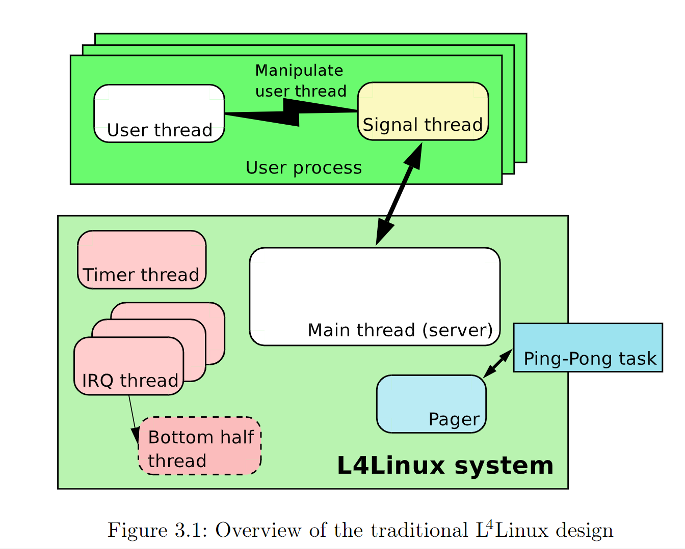
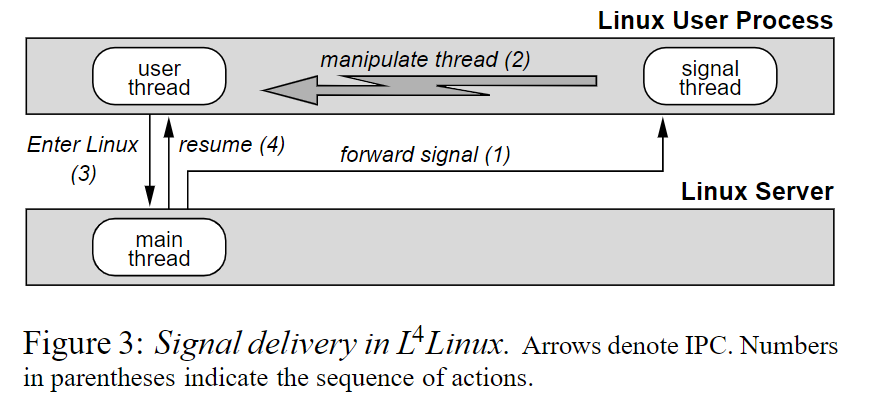

这篇论文的目标是在用户态实现一个基于L4微内核的Linux服务，并与原生的Linux宏内核进行性能对比。

完全二进制兼容 x86 Linux（什么是二进制兼容？），所有可以运行在Linux上的软件，都能在不进行任何更改的情况下运行在L4 Linux上。

## L4 Linux Design and Implementation

Linux内核被设计为一个运行在L4 内核之上的用户态Task（Linux Server）。

#### 内存空间
原生的Linux内核的虚拟地址和物理地址是对等映射。这里采用相同的策略，在Booting之后，将 sigma0设置为Linux Server的Pager。将几乎所有的物理地址map给Linux Server，且为对等映射的方式。（不是所有，会保留一部分物理地址用来存储硬件页表）

为了安全起见，硬件使用的进程的页表依然保存在L4内部，不对外可见，而Linux Server自己也要保存其他用户程序的逻辑页表，因此存在双倍备份的情况。

L4 Linux Server和用户程序进行内存拷贝的时候，需要使用Server中的逻辑页表将用户程序的虚拟地址翻译为Linux Server中的“物理地址”，再进行拷贝。

#### 中断处理与设备驱动
L4 使用同步的IPC通知消息来将中断发送到Server线程。Linux对中断进行了分类：top-half和bottom-half。对于top-half而言，对每个interrupt handler各自用一个Server线程来处理（要求快速响应），而对于bottom-half而言，所有的top-half使用同一个Server线程来处理。为了模拟中断抢占CPU的现象，这些线程在L4内核的优先级设置如下：

top-half > bottom-half > normal Linux Server = Application

#### Linux User Processes
Linux User Process都是用L4的 Task实现的，当然，在Linux Server中存有PCB相关信息。这些Task的Pager被设置为Linux Server。

#### 系统调用机制
Linux Server中有一段仿真代码用于模拟Linux系统调用，在原生Linux中，在用户态执行 int 0x80就会陷入内核态执行内核代码。但在L4中规定：int 0x80会产生exception并终止程序，除非程序装载了exception handler。因此，Linux Server需要把这段仿真代码映射到每个用户程序的地址空间，然后用户程序会把这段代码设置为exception handler。

在仿真代码中，需要将进程中的处理器信息保存到与Linux Server共享的内存区域中，并通过发送 系统调用 类型的同步 IPC 阻塞当前线程，进入Linux Server。返回用户进程后，仍在仿真代码中将处理器状态还原。

另一种方法就是直接修改用户程序使用的通用系统代码（libc中），避免使用 int 0x80 的方式而是直接发送IPC来避免 exception。

#### 信号
在原生Linux内核中，信号会在从内核态返回用户态之前被送到用户进程。而在L4中，由于在逻辑上Linux Server和用户进程可以并行，也就是说，我们无法像传统Linux内核那样用内核直接抢占和阻塞用户线程。因为L4处于安全考虑，不允许不同地址空间的进程（Linux Server和用户进程）相互修改操作。

因此，在L4 Linux中，每个用户进程中有一个Signal thread，当Linux Server向一个用户进程传递信号时，会通过IPC消息发送给Signal thread，由Signal Thread来修改阻塞当前的用户主线程，转去处理信号。

这里有一部分仿真代码和系统调用的仿真代码类似，Signal Thread的会修改主线程的sp和ip寄存器，转去执行Signal 仿真代码。在仿真代码中，会根据信号类型选择自己处理还是进入Linux Server处理。

#### 调度

在L4 Linux中，有两个调度器，一个是L4的，采用固定优先级 + Robin，调度所有的L4 Thread。一个是L4 Linux Server，调度所有的L4 Linux User Processes。设计的目标是让L4 Linux User Processes看起来像是L4 Linux Server在调度。

L4 Linux Server和Linux User Process都是运行在L4 用户空间的普通进程，它们的关系从优先级上讲，是平等的，但是原生的Linux Kernel和User Process是上下级关系。它们的运行关系是非此即彼。

对于单处理机而言，Linux Server和User Process只能运行一个。为了模拟User Process由Linux Server调度，必须要使User Process能够被Linux Server阻塞抢占。

 当Server睡眠，User Process运行的时候，分以下几种情况：
- 发生page fault 或 exception（系统调用或信号），会自动阻塞然后切换到Server执行。
- 当发生中断时，因为处理中断的线程在Server中，且在L4的优先级很高，会被切换到Server执行（个人理解）。
- User Process平稳执行，也不进行系统调用或者page fault之类的。为了不让User Process一直占用CPU使得Linux Server和其他User Process饿死，在L4 Linux中使用L4提供的non-periodic mode，通过给每个User Process一定的time amount，如果这个time amount使用完，就会产生一个timeout fault，而fault的handler指定为Linux Server，实现时间片分配。

# 个人理解

1. 这篇论文主要是证明了微内核实现的系统性能并不逊色于宏内核。因此在设计Linux Server的时候尽量保持原生Linux的基本结构，并不一定是最佳实践方案。
2. 在微内核上构建宏内核服务器，除了证明微内核的性能之外，还有什么实践意义？（多个宏内核服务器共存）。

